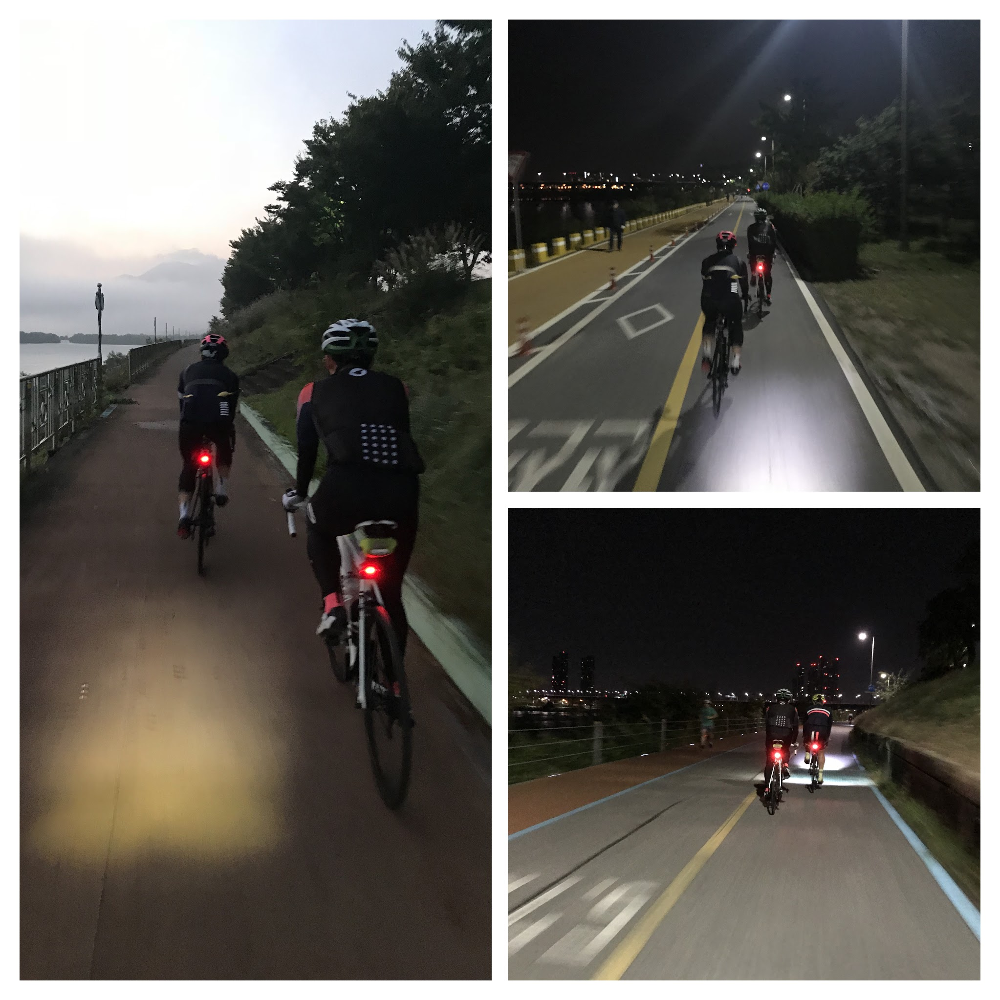

# 속초 투어 log

## 구간1  (반포 - 양평)

웜업 구간으로  대부분 자전거길 주행.
무정차로 양평 해장국집까지 가서 아침식사 계획 (시점으로부터 70km 지점)

#### 반포
- 부푼 마음을 안고 5시에 반포 고수부지에 집결
- 경량화 작업 후 출발 준비
- 출발하려는데 올림픽대로에서 최소 3중추돌 굉음 (사람은 많이 안 다쳤기를...)

#### 한강 남단 구간
- 초반에 오버페이스 방지에 집중하며 그룹 컨트롤
- 각 5km 마다 선두 로테이션 돌며 정속주행
- 광나루 지나서 Assos 저지의 라이더가 팩 후미에 붙음 (그렇게 팔당까지....)

#### 팔당-양수 구간
- 1차 펑신 강림 (상수형 뒷바퀴)
- 1차 펑신과 함께 아소스 라이더는 그대로 가던 길 가심
- 팔당대교를 건넘과 동시에  기상이 급격히 악화됨 (짙은 안개)
- 양수 부근 2차 펑신 강림 (상수형 앞바퀴, 압정박힘)
- 튜브 교체중 3차 펑신 강림 (내 경량 튜브 ㅠㅠ)

#### 양수 - 양평
- 기상은 여전히 좋지 않음
- 1차 봉크 위기를 바나나와 에너지바로 구원
- 코스는 약간 벗어났지만 아는 구간이었기에 무사히 양평신내해장국집 도착
- 다들 들뜬 기분에 저렴한 해장국 안 먹고 고가의 해내탕으로 아침 해결
- 느긋한 마음에 식사 후 건너편 커피집에서 커피 한 잔씩 마시며 정비 후 출발준비

## 구간2 (양평 - 홍천)

#### 양평 - 용문
- 원덕역 - 용문역 등을 지나 6번 국도 안쪽 길을 이용해 주행
- 며느리고개 터널에서 우회길을 잘못 인지하는 바람에 우회하지 못하고 그대로 터널을 통과
- 일부 구간 44번길로 가다가 오안초등학교 쪽에서 좌회전하여 한적한 길로 진입

#### 홍천
- 농로, 천변길 등 통과하며 멋진 풍광 감상 하다보니 홍천 시내 진입
- 스벅이나 맥도날드는 없지만 이디야나 하이마트는 있는 홍천 시내에서 **자전거 하이마트**  에 들러서 소진한 튜브 구매
- 이디야에서 간단히 커피 마시며 봉크난 가민에 보급 후 출발.... 하였지만 곧바로 내가 봉크 위기
- 홍천 빠져나가기 전에 식사를 해야겠다고 느껴 홍천 끝자락 애매한 밥집에서 무맛의 돼지국밥으로 점심식사
	- 밥도 별로 맛이 없었는데 식당 TV에 나오는 전국 노래자랑 출연자들이 밥맛을 한 술 더 떨어뜨림
	- 말은 많지만 주의력은 부족한 주인아지매 대신 상수형이 손님이 흘리고 간 핸드폰 찾아줌

## 구간3 (홍천 - 신남)

- 주로 **44번 국도**  를 타고 가지만 중간중간 회피 코스 등장. 차가 빠르긴 하지만 많지는 않은 구간
- 드디어 도로 표지판에 **속초** 가 등장하기 시작함
- **인제 신남**  표지판 보면서 아재들 신나함
- 주행거리 100 키로(개인 최장거리 라이딩 기록) 넘었다며 상수형은 계속 신남
- 좌골이 슬슬 아려오며 올해 부족했던 마일리지를 원망하기 시작
- 강하게 부는 뒷바람에 `고마운 뒷바람` 생각을 하며 아려오는 좌골에 `이브퀵` 생각도 간절해짐

#### 신남
- 인제까지 가서 쉬려다가 상수형이 **콜라**  를 외치시는 통에 폐업한 편의점 두어개를 지난 후 신남 버스터미널에 있는 편의점에서 2차 휴식
- 당뇨 걱정은 제껴두고 콜라 + 포도당 + 이브퀵 + 에너지바 등을 급히 섭취
- 에너지바 2개 추가구입

## 구간4 (신남 - 내설악)
#### 인제
- 인제터널 우회구간을 미시령 구간으로 착각
	- 이 시점부터 실제 미시령까지 매우 심리적 지루함을 느낌 (끝나간다 생각했는데 아니어서)
- `산림문화박람회`를 하는 통에 인제 시내 복작복작
- 인제 통과시점이 오후 4시쯤. 왜 기억을 하느냐면 기상 알람을 오후로 잘못 맞춘 탓에 갑자기 알람이 울림

#### 내설악
- 아기다리고기다리던 미시령 옛길이 시작되는 시점.
- 문제는 미시령 옛길이라고 빠지는 시점부터 실제 미시령까지 꽤 (20km) 가야한다는 것.
- 중간에 상수형의 콜라사랑으로 세 번째 휴식.
    - 아이스크림을 하나 먹을까 했지만, 냉장고 뚜껑 열어둔다고 구박하는 주인아저씨에 빈정상해 안 사 먹음
- 마지막 휴식이다... 생각하여 남은 보급식량 다 털어 넣고 경량화

## 구간5 (미시령 - 속초)

#### 미시령
- 거의 다 털린 시점. 트와이스의 도움을 받아 오르기 시작
- 정상으로 올라갈수록 거세지는 입체바람. 급해지는 경사.
- 이제 다왔다며 응원해주는 등산객들. 역시 하산객들의 이야기는 걸러 들어야 한다는 사실 검증의 자리.
- 경사가 이렇게 급했나.... 생각을 수십번 한 끝에 도착

#### 속초
- 다 털린 상수형 아드레날린 분출로 초고속 속초 시내행
- 총 225km 주행. 올라간 높이 1900m
- 도착후 치맥으로 마무리!
